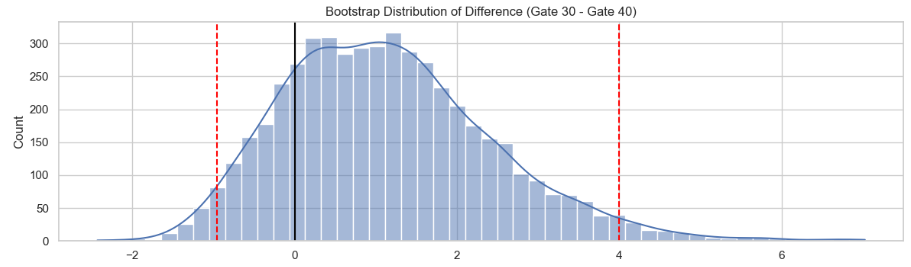
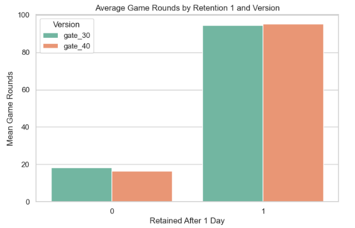

#  **Mobile Games A/B Testing: Retention Impact of Level Gate Placement**

---

## 🔹 Project Overview

This project analyzes an A/B test conducted on a mobile game to evaluate the impact of changing a progression gate from **level 30 to level 40** on player engagement and retention.

The goal is to determine whether delaying the gate improves:
- Player activity (game rounds)
- Short-term retention (Day 1)
- Long-term retention (Day 7)

---

##  Key Results

- No meaningful improvement in player engagement  
- No statistically significant difference in **Day-1 retention**  
- Day-7 retention shows statistical significance, but **effect size (~0.8%) is negligible**  
- Minor **Sample Ratio Mismatch (SRM)** detected  

 **Final recommendation: Keep Gate 30 configuration**

---

## 🔹 Dataset

- Mobile game player dataset  
- Users split into:
  - **Gate 30 group (control)**
  - **Gate 40 group (treatment)**  

Key variables:
- `sum_gamerounds` — total gameplay activity  
- `retention_1` — returned after 1 day  
- `retention_7` — returned after 7 days  

---

## 🔹 Methodology

###  Data Validation
- Checked for missing values and inconsistencies  
- Performed **Sample Ratio Mismatch (SRM) test**  
- Ensured experiment validity before analysis  

---

###  Exploratory Analysis
- Distribution of gameplay activity  
- Retention rates across groups  
- Outlier and skewness analysis  

---

###  Statistical Testing

- Two-sample tests for retention metrics  
- Bootstrap analysis for robustness  
- Confidence intervals for effect estimation  

---

## 🔹 Key Insights

- Player behavior is highly variable (skewed gameplay distribution)  
- No practical difference in gameplay activity between groups  
- **Day-1 retention unaffected by gate change**  
- Day-7 retention difference is statistically significant but **not practically meaningful**  
- Experiment validity slightly affected by SRM  

---

## 🔹 Business Interpretation

This experiment shows that:

- Changing gate position does **not improve user engagement**  
- Statistical significance alone is **not enough for decision-making**  
- Practical impact must be considered alongside p-values  

 The gate change introduces complexity without delivering measurable benefit.

---

## 🔹 Final Decision

The A/B test provides no evidence that moving the progression gate improves performance.

- No meaningful impact on gameplay  
- No improvement in short-term retention  
- Negligible practical effect on long-term retention  

 **Recommended action: Retain Gate 30 configuration**

---

## 🔹 Example Visualizations

  


---

## 🔹 Limitations

- Presence of small Sample Ratio Mismatch  
- High variance in player behavior  
- Results may depend on game-specific mechanics  

---

## 🔹 Tech Stack

- Python  
- pandas, numpy  
- matplotlib, seaborn  
- scipy (statistical tests)  
- statsmodels  

---

## 🔹 Requirements

```bash
pip install pandas numpy matplotlib seaborn scipy statsmodels
```

---


## 🔹 How to Run

1. Clone repository
2. Install dependencies
3. Open notebook:

notebooks/mobile_games_ab_testing.ipynb